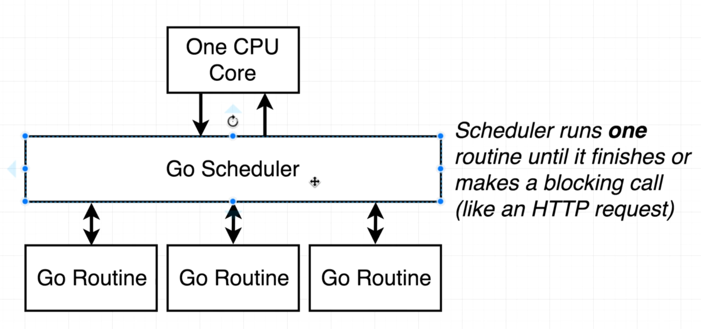

- ## Go: The Complete Developer's Guide

  - We have a couple of go commands available:
    - go build: builds the code and creates an executable file
      - command to build executable file for both windows and macos
      - ```apl
        GOOS=windows GOARCH=amd64 go build -o myprogram.exe main.go
        ```
    - go run: builds and instantly executes the code as well
    - go fmt: formats the code
    - go install & go get: used to manage dependencies and install external packages
    - go test: for running test files
  -
  - A package is like a project/workspace. All files belonging to the same project, must belong to the same package as well
    - We can create either executable or reusable package (like library/dependency)
    - executable package must have the "package main" statement at the beginning
    - any other package name makes it reusable package
    - executable package spits out executable file post build, reusable package doesn't
    - executable package must have a "main" function in it
  -
  - 
    - these are some standard packages that come built in with the go standard library
    - by default, the main package doesn't have access to these built in packages
    - we can use import to import standard library packages, as well as reusable packages by other authors also
  -
  - Go code follows the same pattern always
    - We declare the package at the top
    - Make necessary imports
    - then declare functions to do stuff
  -
  - ## For creating/assigning variables, the syntax is as follows:
    ```go
    card := "sample text"
    ```
    - now this is the shorthand initialization. the actual long form initialization is something like this
    - ```go
      var card string = "sample text"
      ```
    - but go can infer variable type from value, so we don't need to explicitly specify variable type everytime
    - Go is a static typed language, can't change variable type after declaration
    - common variable types: bool, int, string, float64
  -
  - ## Define return type of function like this:
    ```go
    func random() int { }
    ```
  -
  - For dealing with lists, we have arrays and slices in Go

    - Arrays are more like a primitive data structure, with fixed size which cannot be altered after creation
    - arrays are passed by value, **slices are passed by reference**. Slices are flexible in size
    - arrays can be accessed by index, whereas slices are accessed by range
    - bottom line, favour slices over array most of the time, unless there's a very specific use case of arrays
    - ## slice syntax:

      ```go
      cards := []string {"str one", "str two"}
      cards = append(cards, "new string") // append doesn't alter original variable
      // append returns a new updated slice, which we reassign to variable

      // For loop
      for i := 0; i < 3; i++ {
        fmt.Print("hey")
      }

      // Looping over
      for index, card := range cards {
        fmt.Println(index, card)
      } // with every iteration of the loop, go throws out the previous variable
      // initializations, so we have to use := syntax
      ```

  -
  - Go is **NOT** an object oriented programming language
  - ## We build custom functions with receivers to model complex functionalities

    ```go
    type deck []string // declaring new type which is a slice of type string

    // now this is a receiver function, which will be available to variables of type deck
    func (d deck) print() { // d is reference to the specific variable on which this function will run, kind of like this keyword
      for i, card := range d {
        fmt.Println(i, card)
      }
    }

    newCard := deck{"hello", "world"}
    newCard.print()
    ```

  -
  - Replace variables that need to be declared but never used with underscore (to avoid the declared but not used warning)
  -
  - ## Some syntaxes:

    ```go
    cards := []string{"one", "two", "three", "four"}
    cards[0:2] // return slice from index 0 till 2 (not including 2)
    cards[:2] // from beginning upto 2
    cards[2:] // from index 2 till end

    func deal(d deck, handSize int) (deck, deck) {
      return d[:handSize], d[handSize:]
    }

    // always define function args by variable name followed by their type
    // for multiple function return type put (type1, type2 ...)

    hand, remainingCards := deal(cards, 4) // reading multiple returns from function
    ```

  -
  - ## Type conversion in go happens like this: []byte("to be converted"), so to convert deck type to byteslice, we need to convert to []string first ( []string(deck) ) and then join the strings using "strings" standard library

    ```go
    import (
    	"fmt"
      	"strings"
    )

    strings.Join([]string(deck), ",")
    ```

  -
  - ## For reading/writing to file, use the ioutil package functions

    ```go
    ioutil.WriteFile(fileName, []byte, 0666) //default permission to read & write
    bs, err := ioutil.ReadFile(fileName)

    // Standard error handling pattern, nil is equivalent of null in JS
    if err != nil {
      fmt.Println("error: ", err)
      os.Exit(400)
    }
    ```

  -
  - ## Type Conversion of byte slice to deck
    ```go
    ss = strings.Split([]string(bs), ",")
    return deck(ss)
    ```
  -
  - Slice syntax:
    - len(sliceName): will return length of slice
    - sliceName[index]: will return the item at that index
  -
  - Random number generation

    - the math/rand package has a function called Intn which generates numbers in the range of [0,n)
    - but it is pseudorandom, which means it will generate random numbers of the same sequence everytime, because it uses a seed value to generate the sequences which defaults to 1
    - ## to randomize the seed:

      ```go
      source := rand.NewSource(time.Now().UnixNano())
      r := rand.New(source)

      fmt.Println("\n\nWith source:")
      for i := 0; i < 3; i++ {
        fmt.Print(r.Intn(100), " ")
      }
      ```

    - ## swapping in go:
      ```go
      d[i], d[newPosition] = d[newPosition], d[i]
      ```

  -
  - Testing in Go

    - all the test files must end with \_test.go
    - run all the tests at once with "go test"
    - always start test function names in caps
    - ## sample test file syntax:

      ```go
      // deck_test.go

      package main

      func TestNewDeck(t *testing.T) {
        d := newDeck()

        if len(d) != 16 {
          t.Errorf('Expected 16, got %v', len(d)) // this is formatted string, %v will be replaced by value provided afterwards
          // Println doesn't use formatted string, but Printf and Errorf does
        }
      }
      ```

    - ## in case of testing with files, always clean up the file before and after running the test

      ```go
      func TestSaveToFileAndNewDeckFromFile(t *testing.T) {
        os.Remove("_deckTesting") // testing file sample name

        deck := newDeck()
        deck.saveToFile("_deckTesting")

        loadedDeck := newDeckFromFile("_deckTesting")

        if len(loadedDeck) != 16 {
          t.Errorf("error")
        }

        os.Remove("_deckTesting")
      }
      ```

  -
  - Zero values in Go:
    - zero values are used for default initialization
    - if a variable is initialized and not given a value, then rather than using "nil" or anything, zero value is assigned
    - default zero values:
      - int: 0
      - float: 0
      - bool: false
      - string: ""
  -
  - Structs Initialization:

    - a struct is a complex data structure which is comprised of basic data types. it is like objects in javascript
    - ```go
      type person struct {
        firstName string
        lastName string
      }

      func main() {
        alex := person{"Alex", "Anderson"} // need to be mindful of order of fields
        alex := person{firstName: "Alex", lastName: "Anderson"}

        var person alex

        alex.firstName = "Alex"
        alex.lastName = "Anderson"

        fmt.Printf("%+v", alex) // %+v prints the fields as well as the values
      }
      ```

    - ## We can also use other structs as type in our current struct

      ```go
      type contactInfo struct {
        email string
        zipCode int
      }

      type person struct {
        name string
        contact contactInfo // this can be written simply as contactInfo
        // which means the variable contactInfo is of type contactInfo
      }

      func main() {
        jim := person {
          name: "Jim",
          contact: contactInfo {
            email: "email@mail.com",
            zipCode: 700059,
          },
        }
      }
      ```

    - We can use receiver functions on struct types as well in exactly the same manner as we did with slice earlier

  -
  - **Go is a pass by value language** So, by default in receiver functions or normal functions, the variable or function arguments are always received as **pass by value**, so if you modify something directly on that variable, it won't be reflected on the original variable, but only on the copy in the function
  -
  - Pointers in Go

    - if we want to actually update the original variable values in receiver functions, we have to use pointers
    - & operator turns value into memory address
    - - operator turns memory address into actual value
    - ```go
      jimPointer := &jim
      jimPointer.updateName("Jimmy")

      func (pointerToPerson *person) updateName(name string) {
        (*pointerToPerson).firstName = name
      }

      // here *person and *pointerToPerson mean different things
      // *person specifies that the receiver function expects a pointer of type person
      // *pointerToPerson actually converts the pointer memory address to value which can be updated then
      ```

    - ## Go allows for a shortcut, instead of passing the pointer address everytime, we can simply pass the variable of the same root type, and if the receiver function expects a pointer of that same root type, then Go will convert the variable to a pointer itself and deference the pointer in the receiver function implicitly itself

      ```go
      jim.updateName("Jimmy")

      func (pointerToPerson *person) updateName(name string) {
        pointerToPerson.firstName = name
      }

      // works exactly the same as the code above
      ```

  -
  - 
    - Earlier, I had noted that slices are passed by reference. It is true, but the underlying mechanism is like this
    - slice is stored as two separate values, one is the slice data structure which contains a pointer to the head of the array, capacity and length and another is the actual array of data itself
    - slice variable stores the slice data structure only
    - so when a slice is passed as an argument to a function, go actually copies the slice data structure and passes it by value, but since both the original slice and the copy slice have the pointer to the actual data array, modifying data will actually mutate the array value (which is never copied and actually accessed by reference)
    - 
    - So slice is called a reference type, because we can freely mutate values inside it without thinking about pointers
    - For value types, we have to think and use pointers as described above
  -
  - Maps in Go:

    - maps in go are pretty much like objects in javascript, but a major difference between maps and struct is that in maps, all the keys must be of the same type and all the values must be of the same type as well
    - the types of keys and values can be different though
    - ```go
      var colors map[string]string // initialize default empty map

      colors := make(map[string]string) // same as above, different syntax

      colors := map[string]string{
        "red": "ff0000",
        "green": "00ff00",
      }

      colors["blue"] = "0000ff" // you can update existing key in same way

      delete(colors, "red")
      ```

    - iterating over maps is exactly similar to iterating over slice, the only difference being we received two values from range <slice> index, value. here we'll receive key, value
    - you can iterate over the keys of a map because they are indexed, but can't do so in a struct
    - map is a reference type (which means with maps, always a copy of the reference to the underlying data structure is passed), struct is a value type
    - thumb rule is, use map where you would've used plain objects in javascripts (where more object items could be added or removed) and use structs where you would've used strict type with interfaces in typescript

  -
  - Receiver functions with different arguments for the receiver variable can have same names, but general functions cannot have same name in the same go file, even if they have different arguments
  -
  - Interfaces in Go:

    - interfaces in go are a way of writing more flexible and reusable code.
    - Remember, every value in go must have a type. So every function argument must define a type
    - But what if the function implementation is kind of the same, but it requires different types of arguments. Do we define a separate function for each type, with essentially the same implementation inside it?
    - here we use interfaces
    - ```go
      type testInterface interface {
        getGreeting(int, string) (int, error)
      }
      ```
    - now this means, anywhere in our program, if a type implements the getGreeting function with the same input and output types, then it automatically gets upgraded to testInterface by Go
    - So now, instead of making separate functions with separate types, we can simply make a single function, with the testInterface type and reuse the implementation
    - ```go
      package main

      import "fmt"

      // Define an interface called 'Toy'
      type Toy interface {
          Play()
      }

      // Different toys that follow the 'Toy' rules
      type Car struct{}
      func (c Car) Play() {
          fmt.Println("Vroom! The car is moving!")
      }

      type Robot struct{}
      func (r Robot) Play() {
          fmt.Println("Beep boop! The robot is walking!")
      }

      // A function that plays with any Toy
      func PlayWithToy(t Toy) {
          t.Play()
      }

      func main() {
          car := Car{}
          robot := Robot{}

          PlayWithToy(car)   // Works because Car has a Play() function
          PlayWithToy(robot) // Works because Robot has a Play() function
      }
      ```

    - Interfaces can also be clubbed together to make another interface
    - ```go
      type ReadCloser interface {
        Reader
        Closer
      }

      // here ReadCloser interface specifies that for any type to become ReadCloser
      // it has to implement Reader as well as Closer interface
      ```

  -
  - Concrete Type vs Interface Type
    - concrete type is something that you can assign to a value, like int, string, map, struct etc
    - interface type you cannot assign to something, you just create an interface and go automatically upgrades types with matching specs to that interface
  -
  - 
  -
  - ## Making a network call

    ```go
    package main

    import (
    	"fmt"
      	"net/http"
      	"os"
    )

    func main() {
      resp, err := http.Get("http://google.com")
      if err != nil {
        fmt.Println("Error: ", err)
        os.Exit(400)
      }

      bs := make([]byte, 64*1024) // making a byte slice of 64 bytes
      // We cannot directly pass an empty byteslice, because Read function
      // only injects data till the byte slice passed is not completely full
      // So, if we pass an empty byte slice, it will not inject any data into it
      resp.Body.Read(bs)
      fmt.Println(string(bs))

      // This is the standard way of printing response body
      io.Copy(os.Stdout, resp.Body)

      // io.Copy takes a Writer interface and a Reader interface, and internally
      // it's exactly doing the same stuff as above. It's creating a byteslice
      // reading the data into it, then pushing that updated byte slice to a
      // Writer interface for output
    }
    ```

    - The Reader interface is like a common interface for multiple sources of data. Whatever the external source of data to our program is, if it implements the Reader interface, then we'll have a byteslice of data available, agnostic of the data source, which makes it easier to work with multiple sources of data
    - We create a byteslice, and pass it to the Read function which needs to be defined by the Reader interface. It injects the data from the data source into the passed byteslice. And as we've seen before, since slice is a reference type, the original byteslice variable that we had passed, it will be updated to contain the actual data
    - Just like the Reader interface, we also have a Writer interface, which is used to write data to different output channels easily. **Writer interface does not take an empty byteslice though like Reader interface. It should have data filled byteslice to write to output channel**
    - {:height 146, :width 749}
    - 
    - 
    - 
    - We can also make our own custom Writer
    - ```go
      type logWriter struct {}

      func (logWriter) Writer(bs []byte) (int, error) { // if you don't intend on using the variable in the declaration, you can simply omit it and just write the type
        fmt.Println(string(bs))
        fmt.Println("No of bytes: ", len(bs))

        return len(bs), nil // Writer interface documentation specifies that we should return the number of bytes written and error object
      }

      lw := logWriter{}

      // Now we can pass our own Writer to io.copy
      io.copy(lw, resp.Body)
      ```

  -
  - In Go, capitalization of types, function names and variables matter
    - When you capitalize a type, variable or function name, Go basically makes that entity available across your package (basically exports it). Otherwise, you can freely access these entities anywhere in the same package (with/without capitalization), but won't be able to access these outside of the package where they were declared
  -
  - Concurrency in Go

    - The main function in Go is also a goroutine (basically a thread). But it is the parent thread, and the goroutines that we create are child goroutines.
    - main goroutine gets a big preference over child goroutine, that if all the code execution inside main goroutine is finished, then the program exits. It doesn't care if child goroutines are still executing or not
    - By default, network calls and long running processes are blocking calls in Go, which means the main goroutine will wait for these complete before proceeding further
    - To avoid this, we can spawn child goroutine for these long running processes, essentially unblocking the main goroutine
    - ```go
      func checkLink(link string) {
        _, err := http.Get(link)

        // some logic
      }

      go checkLink("http://google.com") // go keyword in front of func call spawns new go routine
      ```

    - Now, the blocking call gets shifted to a separate goroutine, so the main goroutine gets unblocked to execute further code
    - Concurrency vs Parallelism
      - 
      - 
      - By default Go scheduler tries to use all available CPU cores to manage all the goroutines
      - We can however explicitly specify how many cores we want Go to use like this
      - ```go
        numCPU := runtime.NumCPU()
        runtime.GOMAXPROCS(numCPU) // by default, this is set to the number of available CPU cores
        ```
      - 
      - 
    - Now let's say we spawn child goroutines in our program, and post that there is no more code in our main goroutine. The program will exit there (as explained above), and we will never get the results our child goroutines. So, we have to tell the main goroutine to wait till the child goroutines finish.
    - Communication between goroutines is achieved via channels
    - 
    - Channel can only share data of a specific type. We can create different channels to share different types of data, but we can only share a single type of data in a single channel
    - ```go
      c := make(chan string) // the channel is of type string, so it can only share string data

      func checkLink(link string, c chan string) {
        // some logic

        // send data into channel
        c <- "new data"
      }

      // receiving data from channel
      data := <-c
      fmt.Println(data)
      // we can also directly use this
      fmt.Println(<-c)
      ```

    - **Receiving message from a channel is a blocking call**, just like a network call
    - So, if the main goroutine faces a code like <- channel, then it pauses execution and waits for the value from the channel. As soon as it receives a value from the channel, the blocking call is resolved and the main goroutine proceeds further.
    - Now, here is the problem. If there are multiple child goroutines, then we would need multiple blocking channels in main goroutine. Otherwise, as soon as one child goroutine is finished executing, it'll send data in the channel, main goroutine would receive the data and then the main function would be over, while the other goroutines are still executing
    - ```go
      links := []string {
        "http://google.com",
        "http://amazon.com",
        "http://facebook.com"
      }

      c := make(chan string)

      for _, link := range links {
        go checkLink(link, c)
      }

      // for each link, we are spawning a new goroutine
      // so, for each link, we are also creating a new blocking channel, so that the main function
      // waits for all the child goroutines to be over before exiting
      for i := 0; i < len(links); i++ {
        fmt.Println(<-c)
      }
      ```

    - ## Syntax:

      ```go
      // this creates an infinite loop, but it contains a blocking call
      // so the next iteration of the loop will only happen, after it receives
      // a value from the channel
      // so, basically everytime it receives a value from the channel, it creates a new goroutine
      // and it keeps doing so infinitely
      for {
        go checkLink(<-c, c)
      }

      // alternative syntax for the above
      // range c denotes that everytime there is a value in channel c, assign to variable l
      // and keep iterating over
      for l := range c {
        go checkLink(l, c)
      }
      ```

    - Syntax to sleep a goroutine
    - ```go
      time.Sleep(num * time.Second) // pause execution the current goroutine
      ```
    - Now, if you don't want to pause the main goroutine OR the child goroutine, but still want to introduce a delay between two goroutines, you can use a function literal, which is basically an anonumous function
    - ```go
      for l := range c {
        go func() {
          time.Sleep(5 * time.Second)
          checkLink(l, c)
        }()
      }
      ```
    - In the above piece of code, l is a variable whose value is being changed by multiple goroutines, since the channel is passed to other goroutines and they are constantly pushing values.
    - So, as a rule of thumb we should never directly reference variables that are outside the scope of our current goroutine and are being manipulated by other goroutines as well (like here, l is outside the scope of the function literal). We should always pass such values as function arguments
    - ```go
      for l := range c {
        go func(link string) {
          time.Sleep(5 * time.Second)
          checkLink(link, c)
        }(l)
      }
      ```
